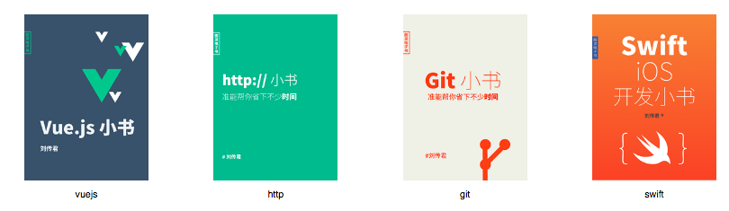

# 使用Nodejs+Mongodb创建图片展示

Web开发过程中，图片上传总是有用的。有人需要提交用户头像，有些书需要图片作为封面。

本文通过一个案例，演示Nodejs在Web上提交图片和显示图片。案例假设一个书籍清单管理的场景，功能如下：

1. 用户提交书的信息，包括标题和封面图片
2. 用户可以查看图片列表

案例程序跑起来的样子：

只要是Web应用程序，都是需要规划URL的，这里的URL设置为：

1. 访问`GET /books`获得图片清单
2. 访问`GET /upload`获取提交图片的界面
3. 访问`POST /upload`提交图片
4. 访问`GET /book/:id`获得id指定的图片

我们需要使用一些库，帮助完成服务器端路由分发、分析表单提交信息、以及从Mongodb中保存和提取数据。具体库分别为Express、connect-busboy、mongoose。使用npm安装这些库即可：

	npm i express connnect-busboy mongoose 

为了简化问题，我把全部过程分解为：

1. 图片提交到Web服务器
2. 图片提交到mongodb
3. 图片从mongodb提取并发送到用户代理（也就是浏览器）

## 图片提交到服务器

图片提交字段为title和cover，通过form提交，提交表格的封装类型为`form/multipart`,具体含义请参考HTTP协议相关资料
。因此也需要特定的包帮助解析，我们使用了`connect-busboy`作为中间件，在自己的自定义流程之前，使用busboy中间件。

	var express = require('express')
	var busboy = require('connect-busboy')
	var app = express()
	app.post("/upload",busboy({  }),function(req,res){
	  var fields = {}
	  req.busboy.on('file', function(fieldname, file, filename, encoding, mimetype) {
	  	var fs = require('fs')
	  	var stream = fs.createWriteStream('./output');
	  	file.on('end',function(){
	  		console.log('finished with fields:',fields,'and redirect')
	  		res.redirect('/upload')
	  	})
	  	file.pipe(stream)
	  });
	  req.busboy.on('field', function(key, value, keyTruncated, valueTruncated) {
	    fields[key] = value
	  });
	  req.pipe(req.busboy);
	})
	app.listen(3000,function(){
		console.log('app listening on 3000')
	})

为了方便使用，这里也准备了几张现成的图片，可以通过执行以下命令获得：

	mkdir img 
	curl http://file.ituring.com.cn/SmallCover/01009e449fbd55d97a7f > img/http.jpg
	curl http://file.ituring.com.cn/SmallCover/010004e91282aff170b6 > img/git.jpg
	curl http://file.ituring.com.cn/SmallCover/010061ef0b279fb427bf > img/vuejs.jpg
	curl http://file.ituring.com.cn/SmallCover/1705fb1c8344451929cc > img/swift.png

可以通过命令行curl来测试代码，这样就可以不必一遍遍的点击选择文件和submit按钮了：

	curl  -F "title=vuejs" -F "cover=@./img/vuejs.jpg" localhost:3000/upload
	curl  -F "title=http" -F "cover=@./img/http.jpg" localhost:3000/upload
	curl  -F "title=git" -F "cover=@./img/git.jpg" localhost:3000/upload
	curl  -F "title=swift" -F "cover=@./img/swift.png" localhost:3000/upload

命令行参数选项`-F`是选项`--form`的简写，表明后面的内容是form的字段。`cover`字段内的@是必须的，它指明是一个文件名，curl会因此读取此文件指定的内容，而不是把字面上的一个值作为字段值。你应该可以看到输出为：

	Found. Redirecting to /upload

并且看到服务器上当前目录有一个新的文件`output`。

也可以使用浏览器，访问`localhost:3000/upload`，手工选择文件，提交表单查看效果。当然前提是加入对`GET /upload`的路由处理：

	app.get("/upload",function(req,res){
		res.send(`<form method="post" enctype="multipart/form-data">
			<input type="text" name="title"/>
			<input type="file" name="cover"/>
			<input type='submit'/>
		</form`)
	})

代码行中需要特别解析的是：

1. 对象req也是一个stream对象，req.busboy也是一个stream对象，因此可以使用代码行`req.pipe(req.busboy);`把两个流连接起来。当req内有新的数据时，会自动的把新的数据导入到req.busboy内，更多信息，请参考[node.stream](https://nodejs.org/api/stream.html)
2. 当`req.busboy`内有了新的数据时，会发射事件`file`,因此代码通过`req.busboy.on('file'...`监控此事件，在监控代码中可以获得file文件流，并在此通过file.pipe()把数据流导入到新建的文件流内，从而把上传文件存储到指定的服务器文件内
3. 除了file类型数据外，其他的输入数据，比如`title`，会在发射field事件内传递其`key/value`对

## 图片传递到Mongodb

图片使用mongoose作为持久存储，分为几个步骤：

1. 引入mongoose
2. 连接mongodb
3. 监视mongoose连接事件
4. 当连接事件发生后，开始express路由设置和监听
5. 当用户提交文件时，把文件片段拼成一个完整的Buffer
6. 写入Buffer到mongoose对象，然后保存此对象到mongodb内

代码如下：

(async()=>{
	var mongoose = require('mongoose');
	await (()=>{
		mongoose.connect('mongodb://localhost:27017/book',{useNewUrlParser: true});
		return new Promise(function(resolve,reject){
			mongoose.connection.on('open', function(){
				resolve()
			})		
		})
	})()
	var Schema = mongoose.Schema;
	var Bookschema = new Schema({
	     cover: Buffer, title: String 
	});
	var Book = mongoose.model('book', Bookschema);
	var express = require('express')
	var busboy = require('connect-busboy')
	var app = express()
	app.post("/upload",busboy({  }),function(req,res){
		  var fields = {}
		  var buffers = []
		  req.busboy.on('file', function(fieldname, file, filename, encoding, mimetype) {
		  	file.on('data',function(chunk){
		  		buffers.push(chunk)
		  	})
		  	file.on('end',async function(){
		  		var a = new Book();
			    a.cover = Buffer.concat(buffers)
			    a.title = fields.title;
			    await a.save()
		  		res.redirect('/upload')
		  		console.log('finished with fields:',a,'and redirect')
		  	})
		  });
		  req.busboy.on('field', function(key, value, keyTruncated, valueTruncated) {
		    fields[key] = value
		  });
		  req.pipe(req.busboy);
		})
	app.listen(3000,function(){
		console.log('app listening on 3000')
	})
})()

为了使用mongoose，首先定义schema。我们需要两个字段（title和cover），title内存储标题，cover存储封面图片，因此定义模式代码是这样的：

	var schema = new Schema({
	    book: { cover: Buffer, title: String }
	});

有了schema定义后，就可以使用save方法，保存一个新的对象到mongodb内，像是这样：

	var a = new Book();
    a.cover = Buffer.concat(buffers)
    a.title = fields.title;
    await a.save()

## 显示Mongodb内的图片

显示图片的实例，需要两个路由，一个是获取全部book的URL，`GET /books`，其中把从Mongodb中获取的book列表提取出来。另外一个是`GET book/:id`在给出book对象的id的情况下，获取单个book的图片和它的标题。

标签`<figure>`配合`<figcaption`可以用来显示图片和它的标题。像是这样：

	 <figure>
  		
  		<figcaption>figure caption</figcaption>
	</figure> 

案例中通过这两个标签来展示对应书籍的图片和它的标题

代码如下：

	(async()=>{
		var mongoose = require('mongoose');
		await (()=>{
			mongoose.connect('mongodb://localhost:27017/book',{useNewUrlParser: true});
			return new Promise(function(resolve,reject){
				mongoose.connection.on('open', function(){
					resolve()
				})		
			})
		})()
		var Schema = mongoose.Schema;
		var Bookschema = new Schema({
		     cover: Buffer, title: String 
		});
		var Book = mongoose.model('book', Bookschema);
		// await Book.deleteMany({})
		var express = require('express')
		var busboy = require('connect-busboy')
		var app = express()
		app.get('/books',async function(req,res){
			var books =  await Book.find({})
			var ans = ''
			for (var i = 0; i < books.length; i++) {
				var iidd = books[i]._id
				var h = 
	`<figure>
		
		<figcaption>${books[i].title}</figcaption>
	 </figure>
	 `
				ans += h
			}
			console.log(ans || "none")
			res.send(ans || "none")
		})
		app.get('/book/:id',async function(req,res){
			var id = req.params.id
			var book = await Book.findOne({_id:id}) // 总是容易忘掉await
			console.log(id,book.covaer)
			res.send(book.cover)
		})
		app.listen(3000,function(){
			console.log('app listening on 3000')
		})
	})()

## 文件上传

命令行上传文件，可以方便的用于测试的目的。如果想要终端用户自己上传文件，需要提供上传界面。这里设定需要对`GET /upload`路由做出响应：

	app.get('/upload',function(req,res){
			res.send(`
	<form action='/upload' enctype='multipart/form-data' method='post'>
		<input type='text' name='title'/>
		<input type='file' name='cover'/>
		<input type='submit'/>
	</form>
				`)
		})

此代码比较简单，不必做额外解释。

## 上传文件大小限定

本案例使用了中间件模块`busboy`提供上传文件解析，可以使用此模块的配置选型，限定上传文件的大小，比如

	app.post("/upload",busboy({limits: {fileSize: 10 * 1024 * 1024}}),function(req,res){} //...

可以限定文件上传大小为10M。如果超过了此大小，busboy默认不会报错，而是直接截掉多出来的部分。如果想要在超限的情况下，做出自己的定制处理，可以监视file对象的事件：

	file.on('limit', function(data) {                                               
	     console.log("LIMIT");
	});

对象file可以在事件req.busboy发射的file事件内获得

	req.busboy.on('file',function(fieldname, file, filename, encoding, mimetype){})

## 总结

本文完成了一个上传图片到Mongodb，并显示全部上传到Mongodb的图片清单。可执行的全部代码如下：

	(async()=>{
		var mongoose = require('mongoose');
		await (()=>{
			mongoose.connect('mongodb://localhost:27017/book',{useNewUrlParser: true});
			return new Promise(function(resolve,reject){
				mongoose.connection.on('open', function(){
					resolve()
				})		
			})
		})()
		var Schema = mongoose.Schema;
		var Bookschema = new Schema({
		     cover: Buffer, title: String 
		});
		var Book = mongoose.model('book', Bookschema);
		// await Book.deleteMany({})
		var express = require('express')
		var busboy = require('connect-busboy')
		var app = express()
		app.get('/books',async function(req,res){
			var books =  await Book.find({})
			var ans = ''
			for (var i = 0; i < books.length; i++) {
				var book = books[i]
				var h = 
	`<figure>
		
		<figcaption>${book.title}</figcaption>
	 </figure>
	 `
				ans += h
			}
			res.send(ans || "none")
		})
		app.get('/book/:id',async function(req,res){
			var id = req.params.id
			var book = await Book.findOne({_id:id}) // 妈蛋，总是忘掉await
			console.log(id,book.covaer)
			res.send(book.cover)
		})
		app.get('/upload',function(req,res){
			res.send(`
	<form action='/upload' enctype='multipart/form-data' method='post'>
		<input type='text' name='title'/>
		<input type='file' name='cover'/>
		<input type='submit'/>
	</form>
				`)
		})
		app.post("/upload",busboy({  }),function(req,res){
			  var fields = {}
			  var buffers = []
			  req.busboy.on('file', function(fieldname, file, filename, encoding, mimetype) {
			  	file.on('data',function(chunk){
			  		buffers.push(chunk)
			  	})
			  	file.on('end',async function(){
			  		var a = new Book();
				    a.cover = Buffer.concat(buffers)
				    a.title = fields.title;
				    await a.save()
			  		res.redirect('/books')
			  	})
			  });
			  req.busboy.on('field', function(key, value, keyTruncated, valueTruncated) {
			    fields[key] = value
			  });
			  req.pipe(req.busboy);
			})
		app.listen(3000,function(){
			console.log('app listening on 3000')
		})
	})()

