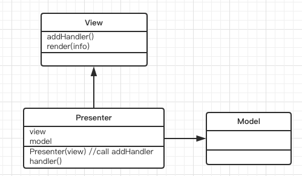

What is MVP?

MVP是Model-View-Presenter的缩写。它是MVC的一个衍生模式，和MVC不同的是把Controller换成了Presenter。通过Presenter，Model和View达到了完全的隔离。更加具体的说：

1. Presenter依赖于Model，它会根据Model更新View
1. Presenter依赖于View，它会注册事件处理函数到视图内，以便当UI事件发生时，可以再次处理。

就是说，View不会依赖Model，也无需如同MVC那样，在Model变化的时候，通过观察器得到通知，更新View自身。这些逻辑，完全放置到Presenter内。除了展示和领域对象，所有功能都放到Presenter内，包括数据管理，载入和保存，应用事件等等。

我们继续从应用开始验证这些基础概念。使用MVP创建应用，首先需要Model，这个Model看起来和MVC中的Model毫无差别：

	class Model{
	}
	class ModelCount extends Model{
		constructor(){
			super()
			this.count = 0
		}
		inc(){
			this.count ++
		}
	}

也需要一组视图：

	class View{
		render(m){
		}
		addHandler(handler){
		}
	}
	class ViewMile extends View{
		constructor(m){
			super()
			this.mile = document.getElementById('mile')
		}
		render(m){
			this.mile.innerHTML = m
		}
	}
	class ViewDollar extends View{
		constructor(){
			super()
			this.dollar = document.getElementById('dollar')
		}
		render(m){
			this.dollar.innerHTML = m
		}	
	}
	class ViewCount extends View{
		constructor(){
			super()
			this.count = document.getElementById('count')
		}
		render(m){
			this.count.value = m 
		}
	}
	class ViewButton extends View{
		constructor(){
			super()
			this.button = document.getElementById('inc')
		}
		addHandler(handler){
			this.button.onclick = handler
		}
	}

每个需要根据Model更新的View都需要一个render方法，传递必要的更新数据进来。对于需要事件处理的View类，比如ViewButton，还需要一个addHandler方法，可以把事件处理代码连接到具体的UI视图上。

接着是本文的主角，Presenter对象，它看起来是一个全能对象，通过它关联全部的视图和模型一起：

	function newStyle(){
		var m = new ModelCount()
		var d = new ViewDollar()
		var mile = new ViewMile()
		var c = new ViewCount()
		var b = new ViewButton()
		var c = new Presenter(m,d,mile,c,b)
	}
	class Presenter{
		constructor(m,dollar,mile,count,button){
			this.mile = mile
			this.count = count
			this.button = button
			this.dollar = dollar
			this.m = m
			var self = this
			this.button.addHandler(this.handler.bind(this))
		}
		handler(){
			this.m.inc()
			this.count.render(this.m.count)
			this.mile.render(this.m.count)
			this.dollar.render(this.m.count)			
		}
	}

此对象内存储每一个相关的视图和模型对象，并且实现了事件的关联和模型变化后对视图的更新。

使用MVP的一个比较大的好处，是不管有几个视图，这些视图的展示逻辑看起来多么不同，它们都可以共享相同的一个Presenter。

这里特别要注意，尽管当Model更新时，View是需要Model内的数据的来完成同步更新的，但是并不需要一个完整的Model，而只是其中的局部几个属性的数据，至于哪些内容需要传递是View，哪些无需传递，这个逻辑代码是由Presenter来负责的。经过Presenter的中介，于是就可以做到了这样的效果：即使View需要Model的数据，但是并不需要引用Model。

完整的代码在此下载：[MVP Demo](demo/mvp.html)

	