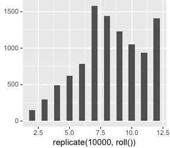

# R

R是一门统计语言，对向量矩阵等常用的统计类型有良好的支持，并且可以绘制专业的统计图形。本文试图以一个案例，贯穿R语言的基本概念，包括对象、向量、函数以及库的使用。

案例是玩大小骰子。创建两个骰子，并且显示丢骰子的合计分布、以及如何作弊以便是的大点出现的概率更大。

## 安装

在MAC上安装R非常简单，只要如此：

	brew install r
然后执行：
	
	$r

即可进入r语言的交互状态。

## 创建一个向量

骰子共有六个面，投出来朝上的数字可能是1-6这6个数字之一。R提供了一个内置函数sample，可以从6个数字中摇出两个随机数字：

	sample(1:6,size=2,replace=TRUE)

第一个参数指示数字范围，第二个数字指示几个随机数同时发生，第三个参数指示同时发生的随机数是否可以一样。

既然是玩骰子比大小，那么当然应该求和两个随机数的骰子来决定大小，可以使用sum求和：

	sum(sample(1:6,size=2,replace=TRUE))

为了使用方便，封装它们为一个函数

	roll<-function(){
		sum(sample(1:6,size=2,replace=TRUE))		
	}

现在，只要调用函数roll(),即可算是一次骰子的模拟：

	roll()

可以使用replicate模拟多次骰子：

    replicate(10,roll())
输出的样子：

	> replicate(10,roll())
	 [1] 10  4  3  8  6  7  6  5  7  5

想要知道骰子摇下去的大小值分布吗？可以使用直方图绘制直观的了解之。想要绘制直方图，需要安装R的库，名字叫做ggplot2。

## 安装R库的方法
只要此命令即可安装ggplot2包：

	install.package("ggplot2")

使用前需要加载它：

	library("ggplot2")

## 绘制直方图

绘制直方图，只需要传递向量给函数qplot:

	qplot(replicate(10000,roll()),binwidth=0.5)

可以看到分布是正态的。

## 作弊

想要大数字多出来一点，怎么办？只要修改roll()函数，让数字6的概率高点即可。使用参数prob，可以指定数字出现的概率。

	roll<-function(){
		sum(sample(1:6,size=2,replace=TRUE,prob=c(1/8,1/8,1/8,1/8,1/8,3/8)))
	}

就是说，6出现的概率为八分之三，其他都是八分之一。在此绘制直方图，可以看到摇骰子10000次后，大数分布明显上升。

笔记于： 《R语言入门与实践》第一章
